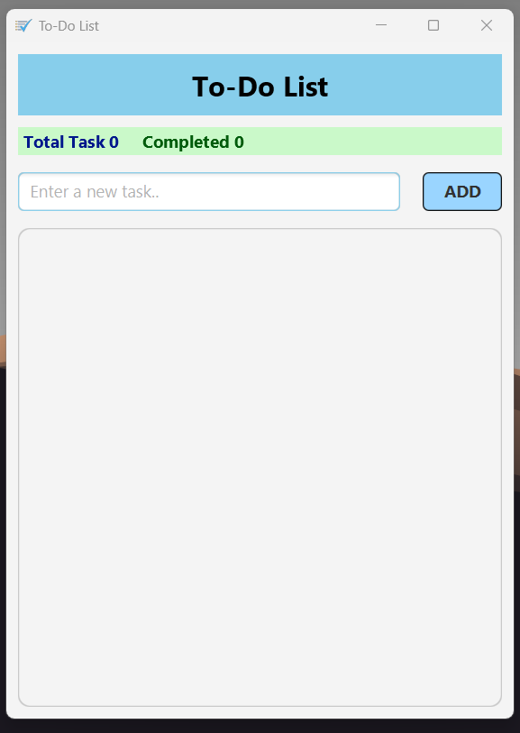
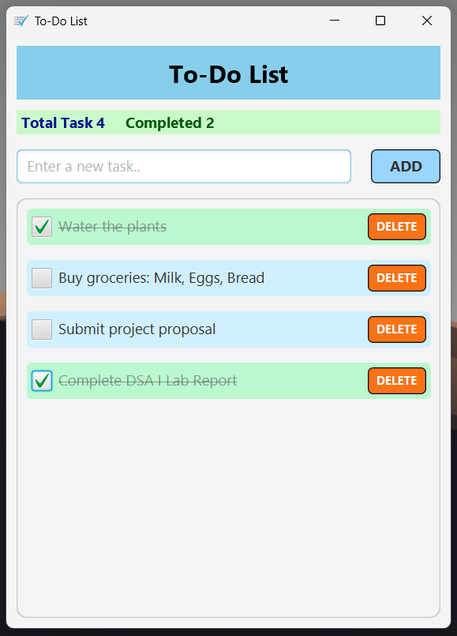
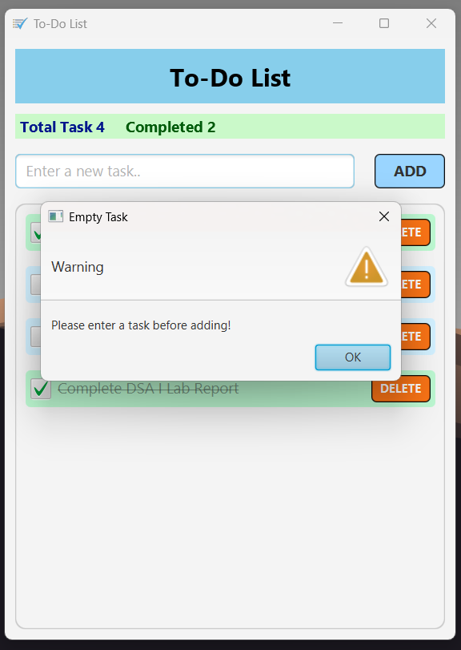

# JavaFX To-Do List 📝

*A software development project created for CSE 2100 - Software Development Project I.*

This repository contains a dynamic To-Do List application that was built using Java and JavaFX. Originally created as an assignment for the Software Development Project I course (CSE 2100), this project was utilized as an opportunity to gain hands-on experience with event-driven programming and real-time UI updates. The primary goal had been to go beyond the basic requirements to develop a clean, custom-styled application that proved genuinely useful for tracking daily tasks.

## Screenshots

| Active Task List | Completed Tasks | Input Validation |
| :---: | :---: | :---: |
|  |  |  |

## Features and Functionalities

* **Task Management:** Users can add new tasks to the list using the designated input field and control buttons.
* **Dynamic Statistics Tracking:** The application automatically calculates and displays the total number of tasks and completed tasks in real-time.
* **State Management:** 
  * Interacting with a task's checkbox dynamically updates the UI state.
  * Completed tasks are visually distinguished via background color changes, text strikethrough, and reduced opacity to separate them from pending tasks.
* **Deletion Capabilities:** Tasks can be permanently removed from the list, prompting an automatic recalculation of both total and completed statistics.
* **Input Validation:** The system prevents the creation of null or blank tasks by intercepting empty inputs and generating a warning dialog box.
* **Scalable Interface:** Implements a `ScrollPane` to ensure the graphical interface remains functional and formatted regardless of the number of active tasks.

## Limitations and Known Issues

* **Data Persistence:** The application currently runs entirely in memory. It does not serialize or save tasks to a local database or file; all data is cleared upon termination of the application.
* **Task Modification:** Existing tasks cannot be edited after creation. Users must delete the task and instantiate a new one to apply corrections.
* **Sorting Capabilities:** Tasks are rendered in chronological order based on creation. There is currently no algorithmic sorting to group tasks by completion status.

## Future Enhancements

Planned updates andimprovements for this repository include:

* **Keyboard Integration:** Enabling the addition of tasks by pressing the "Enter" key to streamline the user workflow.
* **Duplicate Task Prevention:** Implementing validation logic to detect and restrict the creation of identical tasks within the active list.
* **Task Prioritization:** Introducing functionality to assign, display, and manage tasks based on defined priority levels (e.g., High, Medium, Low).
* **Due Date Tracking:** Integrating a date picker component to assign deadlines to individual tasks and render them directly within the user interface.
* **Inline Task Editing:** Allowing users to modify the text strings of existing tasks without the need to delete and recreate them.

## Built With

* **Java** - Core application logic.
* **JavaFX** - GUI rendering, dynamic styling (CSS), and event handling.

## Author

**SAD IBNA FORID**
* Student ID: 0802510205101020
* Course: CSE 2100 - Software Development Project I
* University: Bangladesh Army University of Science & Technology, Saidpur

Feel free to reach out or connect with me on [LinkedIn](https://www.linkedin.com/in/sadudoy) or check out my other projects on [GitHub](https://github.com/sadudoy).